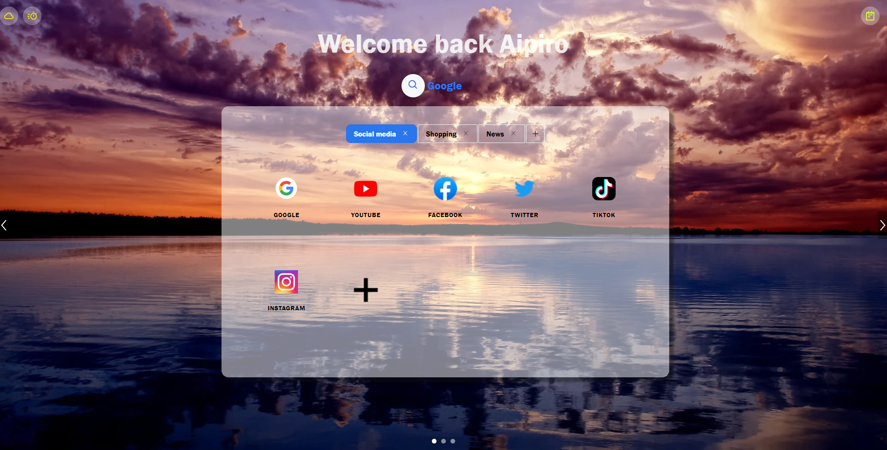
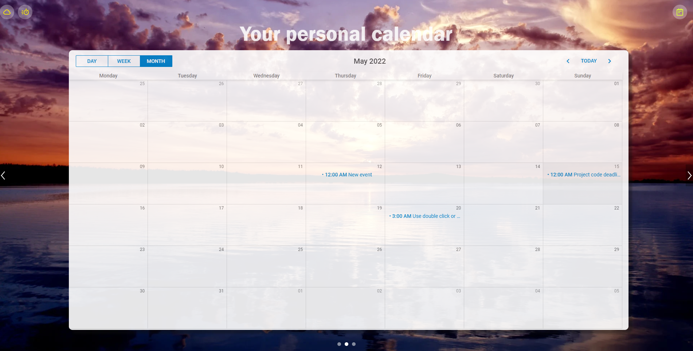

# Your Personal Start UP Page
Hi
This project was bootstrapped with [Create React App](https://github.com/facebook/create-react-app) and supported by [AntMotion library](https://motion.ant.design/).
Our project includes a user account system, a customised search bar, a bookmark collection, a calendar-based schedular, a breaking news feed, a count-down function, sticky notes and a weather display. Details of those functions are listed below.
Note that the functionality of receiving a random password with a registered email address when the user forgets the original password would require the .env file, which is _NOT_ in the repository. Please email Isaac blin510@aucklanduni.ac.nz to get the .env file if you don't already have one.

## Run this project on your local machine

To run this project, first you need to download the repo to your local machine and open it in your code editor. Then run following commands in your terminal to install the dependencies and start the backend:

```
cd backend
npm install
npm start
```

Open another terminal and run following commands to start the frontend:

```
cd frontend
npm install
npm start
```

Open [localhost:3000](https://localhost:3000) to view the project.
Create your own account through the login page and start using your personal start up page!

## Application Structure

### backend

### src folder

This is the folder where the backend routing and databse code resides

### ├── database

Include a test folder containing test files for the database, a schema.js file for database schema, and dao files for handling database operations.

### ├── middleware

Include a middleware.js file containing a function to create a global local user after user logging, and a local middleware function to verify authentication.

### ├── routes

Include a test folder containing test files for the server, a api folder containing routes for different operations, and an index.js file.

### ├── server.js

Entrance file to start the server.

### .gitignore

This is a file for git version control, and contains a list of files which needs to be ignored by Git.

### babel.config.js

Config file for babel.

### jest.config.js

Config file for jest.

### package.json

It records important metadata about a project which is required before publishing to NPM, and also defines functional attributes of a project that npm uses to install dependencies, run scripts, and identify the entry point to our package. This app is supported by react-app-rewired command.

### frontend

### public folder

Inside the public folder, we can see the index.html file. It is a template that will be processed with html-webpack-plugin. here is a div with id=app in the index.html file and that's where our components will be mounted to.

### src folder

This is the folder where the application source code of our application resides.

### ├── _ mocks_

Include the config files for testing

### ├── _ tests _

include test files for testing

### ├── AfterLogin

This folder contains components that will be used in the After a user logging, including a component folder with all component files(bookmark, calendar, countdown timer, Drag, news,searchBar,userProfile, weather, banner, and footer), a less folder with styling files, a data.source.js file with the ant motion source structure code, an index.js file as the entrance of this folder, a utils.js file, and a media folder containing audio.

### ├── globalComponent

Include a pageNotFound.js and a PreLoader.js file which will be use globally

### ├── helper

Include hepler functions

### ├── Login

This folder contains the components used in the Login page, including a component folder with component files, a less folder with styling files, a data.source.js file with the ant motion source structure code, and an index.js file as the entrance of this folder, and a utils.js file.

### ├── router

Include a router.js file containing the routes for the web app

### ├── App.js

Root component for the web app

### ├── App.test.js

Default react test file

### ├── AppContextProvider.js

Context provider file for sharing states among all the components

### ├── index.js

Entrance of the web app

### ├── serviceWorker.js

Service worker configuarion file

### ├── setipTest.js

Configuration files for jest

### .gitignore

This is a file for git version control, and contains a list of files which needs to be ignored by Git.

### babel.config.js

Config file for babel.

### config-override.js

This file provide customised configuration of the application. In this app, it will use less loader and lazy load the ant design library

### package.json

It records important metadata about a project which is required before publishing to NPM, and also defines functional attributes of a project that npm uses to install dependencies, run scripts, and identify the entry point to our package. This app is supported by react-app-rewired command.

## Navigation

The user will be navigated to different pages based on a user's authentication status.

- Unauthenticated

Unauthenticated users will be only able to see and use the functionalities on the login page. For example, an attempt to enter the homepage will be redirected to the login page.

- Authenticated

Authenticated users will be redirected to the homepage and not be able to go back to the login page. Entering an unmatched URL will be directed to a '404 not found' page.

## Functionalities

### User Account

Users will be able to register, log in, log out and edit their profile through the user account system. Input validation is supported by [react-hook-from](https://react-hook-form.com/) package.

- Register an account

New users can click the slide button to enable the sign-up mode. Unique username, unique email, and password are required and need to be validated with predefined rules. Password will be hashed and encrypted. User information will be stored in the database.

- Login

By providing the correct UsernameUsername and password, the user will be able to log in and redirect to the home page. In addition, a cookie authtoken will be generated after logging in, which will be used to ensure users are authenticated.

- Logout

By clicking the logout button on the footer, the authtoken will be removed, and the user will be redirected to the login page.

- Edit Profile

A pop-up box will appear by clicking the user icon on the footer. Users can change UsernameUsername, email and password here, and their input will be validated with predefined rules. Note that while the user is editing the profile, some functionalities will be disabled, such as adding bookmarks and adding events in the calendar.

- Forget password

If users forget their passwords, they can click the 'forget your password?' button at the bottom of the login form. A random password will be sent to the email address associated with their username. Users can use a random password to log in. After logging in, they can change their password. This is functionality is supported by [emailjs](https://www.emailjs.com/).Note that this functionality requires the .env file, which is _NOT_ in the repository. Please email Isaac blin510@aucklanduni.ac.nz to get the .env file if you don't already have one.

### Bookmark

The bookmark function is displayed on the main page whenever you log in and used to save the web site's URL address for future reference. The multiple tabs function is also supplied, which differentiates the bookmarks into serval categories. It offers new users initial data and allows them to customize their personal bookmarks. Your bookmarks will be linked with your account and saved into the database. The website will display your last setting when you log in next time. (Please refresh the page if it takes a very long time to load.)

- Create a bookmark

To create a new bookmark under the target tab, click on the large add button at the end of the bookmark list (Scroll down if plenty of bookmarks are displayed). A popup modal window with the text input box will appear for the user to fill in the Bookmark title and URL. Null URL is not allowed. A notification will pop up if the URL input is null. The new bookmark will be displayed after the last bookmark under the target tab with the target URL website logo and entered bookmark name.

- Delete a bookmark

Move the mouse and hover the area under the target bookmark. A black REMOVE button will appear, and click it to delete the target bookmark.

- Create a tab for the new bookmark category

Click on the small add button in the top right corner of the tab bar. A new tab will be created with an initial Google Bookmark.

- Modify the tab name

Double click the tab name. An popup modal window with the text input box will appear for the user to fill in the new tab name. The tab name is required to be unique, and a notification message will pop up if your tab name input is duplicated.

- Delete a tab

Click on the small delete button beside the tab name. All the bookmarks under the target tab will be deleted as well. If you remove all the tabs, the initial tab data will appear after the refresh.

- Scrollable

Each tab can be scrolled down when the tab's bookmarks reach the display limit.

[Modal, Notification and Tab component from Ant Design,nanoid package used for unique tab title]

### Search Bar

The search bar function allows users to search inputs from different search engines and supports voice recognition. Press enter to navigate to a search engine with the search input.

- Voice search

When users click on the search icon, the search bar will expand, and a microphone icon will appear. Click on the microphone icon, and it will flash. Speak while the microphone is flashing, and the result will appear in the search bar and redirect to the selected search engine page with the result. This function is supported by [react-speech-recognition](https://www.npmjs.com/package/react-speech-recognition) package. An error message will appear if a user's browser does not support the speech recognition or the microphone is disabled.

- Search with different search engines

Next to the microphone icon, there is a selection where you can choose to use Google, Bing, Youtube, TikTok, or Yahoo to search your input. After expanding the search bar and entering input, you can change the search engine to navigate to a different search engine with the input. Alternatively, you can press enter to enable navigation. Note that only when you change to another search engine with non-empty input will enable the navigation. The default search engine is Google.

### Calendar

Our calendar implements the library from [DHTMLX-Scheduler](https://docs.dhtmlx.com/scheduler/). You can find more information about it here and do your customization base on the documentation.

The calendar function is linked with your account, and all your created events will be sent to the database.
There are three kinds of views of the scheduler, days view, weeks view and months view. Following is a description of our calendar functionalities.

- Double Click

Double click to create a new event or edit an existing event. The time select and delete function will show in the form.

- Show Details

Put your pointer on an existed event, and it will show the detail of this event, including the event name, start time and end time.

- Complete an event

When an event is completed, double click on it and change the value of Completion to true, the event will show in a different colour with a cross-out line.

- Draggable event

Existing events can be dragged to the place you want, and the variables will be saved to the database. You can also drag on empty cells to create an event in both weeks view and days view. Events can also be dragged to re-adjust the duration.

### Breaking News Feed

The breaking news feed function uses the [NEWS API](https://newsapi.org/) and fetches immediate news.

- Carousel

The fetched news is put in a carousel and animated. Each card contains a piece of news and will be switched every 3000ms. The animation will stop when the mouse hovers over a card, and the left and right arrow and a selection will appear where the user can click either arrow to switch to the previous news or the following news. Clicking a piece of news title will navigate the user to the external website.

- Select news source

Users can change the selection value to view different news sources.

- Add news to bookmarks

Clicking the bookmark icon on each card will add the news URL and title to the bookmarks under the tab of the selected news source's value.

- Scrollable

Each card can be scrolled down when the news reaches the display limit.

### Sticky note

There is a small sticky note icon in the top right corner of each page.
Clicking on the icon will bring up a sticky note popup window in the top right corner.
There is an 'add' button in the top right corner of the popup window. Click on it, and an input box (Antdesign) will pop up.
The entered information will be displayed as a sticky note in the sticky note popup window.

- Modify sticky note

On the top right corner of each sticky note, there is a modify tab, click on it, and a popup window will appear for the user to modify it.

- Delete Sticky Notes

On the top right corner of each sticky note, there is a Delete tab, click on it to delete the sticky note.

- Scrollable

The notes container can be scrolled down when the notes reach a display limit.

- Draggable

Click and hold the sticky note and move the mouse to drag the sticky note, and the next time you log in, the sticky note will still be in the same position as the one you dragged. (Using [react-beautiful-dnd package]: https://github.com/atlassian/react-beautiful-dnd)

### Weather Display

Clicking on the left top corner's weather icon will display the immediate weather condition of the user's current location.
The weather display function uses the [OPEN WEATHER API](https://openweathermap.org/api) to fetch the immediate weather condition and use HTML5'S [GEO LOCATION API](https://www.w3schools.com/html/html5_geolocation.asp) to fetch the latitude and longitude of the user's current location.

### Countdown Timer

Clicking the left top corner's timer icon will display the box where you can add multiple timers to countdown for your important days. A message will be displayed when a timer's countdown is completed. Countwon timers are stored in local storage.

- Add a timer

A date picker will appear when users hover the mouse to the top of the box. Users can choose a date from the date picker, and a countdown timer will be created and displayed. Each time a user changes the date picker's input, a new timer will be started and displayed. Choosing a past day is not accepted, and an error notification will be displayed.

- Delete a timer

When the user hovers on each timer's top right side, a delete icon will appear. Clicking that icon will delete a corresponding timer.

- Scrollable

The timer box can be scrolled down when timers reach the display limit.

- Reminder

If a user has set timers before, the timer box will pop up every time the user logs in or refreshes the page with a leapfrog sound. On the other hand, if the user did not set any timer before, the leapfrog sound would happen the first time when the user clicks the timer icon. Note that modern browsers forbid web pages to play audio automatically without previous user interaction. Thus, you might not get any sound when you refresh the page if you did not have any interaction with the web page.

## Testing

### Code Testing

Some testing files have been set up to test both frontend and backend code. Frontend code testing expects to fail, and backend code testing expects to pass.

### Function Testing

Team members have been creating testing accounts to consistently test the functionalities and user experience of the web app.

## Responsive Design

The web app is largely responsive and able to fit the different screen sizes. However, some functionalities might be lost or altered when the user uses a smaller screen.

## Screenshot






